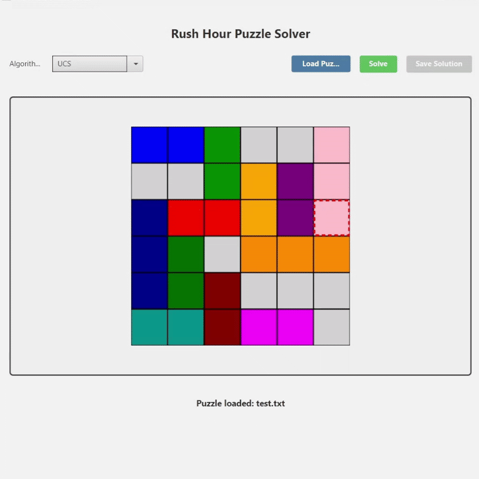

# 🚗 Tucil 3 - Rush Hour Solver 🧠


<div align="center">
    
</div>
---

## 📌 Deskripsi Singkat

Tugas Kecil 3 ini merupakan implementasi penyelesaian puzzle **Rush Hour** dengan algoritma pencarian jalur (*pathfinding*), meliputi:

- **Uniform Cost Search (UCS)**
- **Greedy Best First Search (GBFS)**
- **A\*** (A Star)

Program dikembangkan menggunakan **Java** dan **JavaFX**, dilengkapi dengan antarmuka pengguna (GUI) serta animasi pergerakan solusi. Terdapat juga fitur bonus berupa **pemilihan heuristic alternatif**.

---

## 💡 Fitur Unggulan

- ✅ Input konfigurasi permainan melalui file `.txt`
- ✅ Output langkah per langkah secara visual
- ✅ Pemilihan algoritma pencarian: UCS, GBFS, A\*
- ✅ Pemilihan heuristic: *Distance to Exit*, *Total Cars Blocking*, *Combined*
- ✅ GUI interaktif berbasis JavaFX
- ✅ Cross-platform: mendukung Windows dan MacOS

---

## 🛠️ Requirement dan Instalasi

### **Prasyarat:**
- Java JDK 21+
- Sistem operasi: Windows / MacOS / Linux

---

## 🚀 Cara Menjalankan Program

### 💻 Untuk pengguna **Windows**:
```bash
.
.\run.bat
```

### 🍎 Untuk pengguna **Mac/Linux**:
```bash
.\run.sh
```

Program akan membuka GUI utama yang memungkinkan Anda untuk:
- Memuat file konfigurasi `.txt`
- Memilih algoritma dan heuristic
- Menjalankan dan melihat solusi secara visual

---

## 📂 Struktur Repository

```bash
Tucil3_13523015_13523039/
├── src/               # Source code Java
├── bin/               # Hasil kompilasi (jika ada)
├── test/              # Kumpulan test case dan output solusi
├── doc/               # Laporan PDF
├── run.bat            # Script run untuk Windows
├── run.sh             # Script run untuk Unix/Mac
└── README.md
```

---

## 👨‍💻 Author

- **13523015** – Maheswara Bayu Kaindra
- **13523039** – Peter Wongsoredjo

Tugas ini dibuat untuk memenuhi **Tugas Kecil 3 IF2211 Strategi Algoritma** 2024/2025 – Institut Teknologi Bandung.

---

## 🎁 Bonus Fitur (Implemented)

| Fitur Bonus                         | Status |
|------------------------------------|--------|
| Implementasi GUI                   | ✅     |
| 2+ Heuristic Alternatif            | ✅     |
| Output animasi gerakan (GIF)       | ✅     |

---

